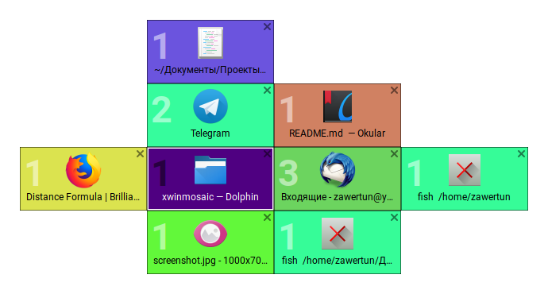

XWinMosaic
==========

X11 window switcher that draws windows list as a colourful mosaic
------------------------------------------------------------

Inspired by [XMonad.Actions.GridSelect](http://xmonad.org/xmonad-docs/xmonad-contrib/XMonad-Actions-GridSelect.html), but written in C + GTK+2, uses nice-looking colours and has some set of helpful features.

Use arrow keys (also `C-n`, `C-p`, `C-f`, `C-b` in default mode, `hjkl` in vim mode) or mouse to navigate through windows.
Start typing to search for required window.

Config file is created automatically on a first program run and stored in `~/.config/xwinmosaic/config`.

### Usage:
    Usage:
      xwinmosaic [OPTION...]  - show X11 windows as colour mosaic

    Help Options:
      -h, --help                   Show help options
      --help-all                   Show all help options
      --help-gtk                   Show GTK+ Options

    Application Options:
      -r, --read-stdin             Read items from stdin (and print selected item to stdout)
      -p, --permissive             Lets search entry text to be used as individual item.
      -t, --format                 Read items from stdin in next format (comma separated):
                                        <desktop_num>, <box_color>, <icon>, <label>, <opt_name>.
                                   Icon can be path to png file or icon name from theme.
                                   Any option, except <label> can be skipped
                                   <icon> should be a path to png file or icon name from theme
                                   Any positive value of <desktop_num> allowed.
                                   <box_color> should be in #nnnnnn format, otherwise it will be skipped.
      -V, --vim-mode               Turn on vim-like navigation (hjkl, search on /)
      -C, --no-colors              Turn off box colorizing
      -I, --no-icons               Turn off showing icons
      -D, --no-desktops            Turn off showing desktop number
      -T, --no-titles              Turn off showing titles
      -S, --screenshot             Get screenshot and set it as a background (for WMs that do not support XShape)
      -P, --at-pointer             Place center of mosaic at pointer position.
      -s, --selected=<N>           Select box number N at spawn. (default: 0)
      -W, --box-width=<int>        Width of the boxes (default: 200)
      -H, --box-height=<int>       Height of the boxes (default: 40)
      -i, --icon-size=<int>        Size of window icons (default: 16)
      -f, --font="font [size]"     Which font to use for displaying widgets. (default: "Sans 10")
      -o, --hue-offset=<int>       Set color hue offset (from 0 to 255)
      -F, --color-file=<file>      Pick colors from file
      --display=DISPLAY            X display to use

### Dependencies:

* [EWMH compatible Window Manager](http://en.wikipedia.org/wiki/Extended_Window_Manager_Hints)
* GTK+2
* CMake

### Installation:

* Debian/Ubuntu: https://launchpad.net/~soulthreads/+archive/xwinmosaic/ (might be old, better build it yourself)
* ArchLinux: https://aur.archlinux.org/packages.php?ID=59660
* Gentoo: https://github.com/funtoo/flora/tree/master/x11-apps/xwinmosaic
* openSUSE (packages for 11.4, 12.1 and Tumbleweed): http://download.opensuse.org/repositories/home:/ZaWertun:/gtk2/

Other distributions/for development:

	cd xwinmosaic
	mkdir build
	cd build
	cmake ..         # or cmake -DCMAKE_BUILD_TYPE=Release -DCMAKE_INSTALL_PREFIX=/usr ..
	make
	./src/xwinmosaic # or sudo make install, if you trust me. :)

### Color file format:

Color file can also be stored at path `~/.config/xwinmosaic/colors`.

	[colors]
	# Use xprop to determine window class
	WindowClass1 = #112233
	WindowClass2 = #445566
	# For other windows to use. You can omit that line and it will use standard colorizing scheme.
	fallback = #778899; #AABBCC; #DDEEFF
